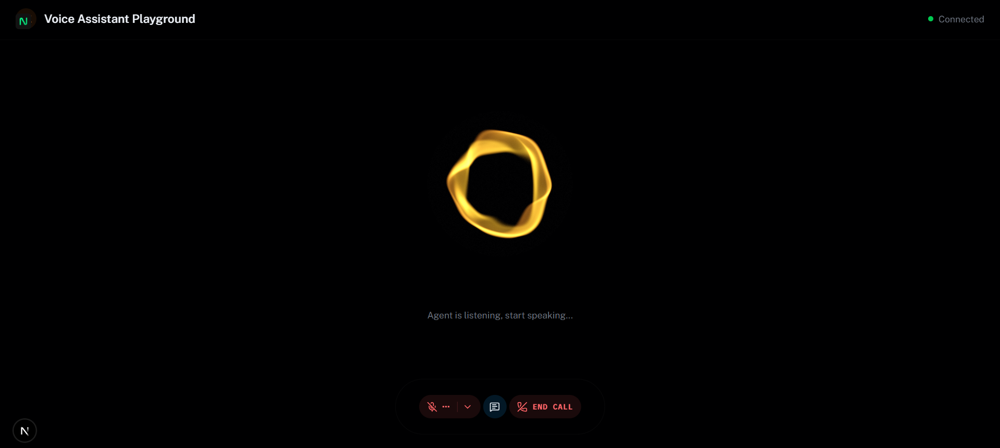

# Nivora - Multi-Agent AI Voice Assistant System

**Nivora** is an advanced, multi-agent AI voice assistant system that combines a powerful Python-based LiveKit agent backend with a sleek Next.js React frontend. It features seamless persona switching, screen sharing vision capabilities, and extensive automation tools for both technical tasks and daily life management.

## System Architecture

The project consists of two main components:

1. **Backend Agent (`backend/`)**: A Python-based LiveKit system featuring multiple agent personas, vision capabilities, and various automation tools.
2. **Frontend Interface (`frontend/`)**: A modern Next.js 15 React application providing the web-based user interface for real-time interaction.

---

## 🛠️ Technology Stack

### Backend
* **Language:** Python 3.13+
* **Framework:** LiveKit Agents SDK
* **LLM Model:** AWS Bedrock Nova Pro (Multi-modal with vision support)
* **Text-to-Speech (TTS):** Edge TTS (Microsoft Neural Voices - **Free**)
* **Speech-to-Text (STT):** Groq Whisper (**Free** tier available)
* **Automation:** Playwright/Selenium (for Browser & E-Box automation)

### Frontend
* **Framework:** Next.js 15, React 19
* **Language:** TypeScript
* **Styling:** Tailwind CSS, shadcn/ui
* **Real-time Comms:** LiveKit Components React

---

## 🚀 Quick Start Guide

### 1. Backend Setup

Open a terminal and navigate to the backend directory:

```bash
cd backend
```

Create and activate a virtual environment:
```bash
# Windows
python -m venv venv
venv\Scripts\activate

# Unix/macOS
python -m venv venv
source venv/bin/activate
```

Install dependencies and necessary browser binaries:
```bash
pip install -r requirements.txt
playwright install chromium
```

Configure your `.env` file (see `CLAUDE.md` or `.env.example` for details on AWS, LiveKit, and Groq keys).

Start the main multi-agent system:
```bash
python agent.py start
```

### 2. Frontend Setup

Open a second terminal and navigate to the frontend directory:

```bash
cd frontend
```

Install the dependencies using `pnpm`:
```bash
pnpm install
```

Configure your `.env.local` file with your LiveKit credentials:
```env
LIVEKIT_API_KEY=your_livekit_api_key
LIVEKIT_API_SECRET=your_livekit_api_secret
LIVEKIT_URL=wss://your-livekit-server-url
```

Start the development server:
```bash
pnpm dev
```

Finally, open your browser and navigate to **http://localhost:3000** to interact with Nivora!

---
### Nivora Playground Interface image



## 🧠 Core Features & Capabilities

### Multi-Agent Persona System
The system utilizes explicit agent transfers to seamlessly switch between specialized personas:
* **InfinAgent (Jarvis):** Your life management assistant. Handles emails, calendars, notes, reminders, and Google Sheets using a professional female voice (`en-US-AriaNeural`).
* **NivoraAgent:** Your technical and study companion. Handles coding, debugging, web searches, Spotify control, and course automation using a calm male voice (`en-US-GuyNeural`).

### Screen Share Vision
Nivora can "see" your screen when you share it via the web interface. It buffers video frames and uses AWS Bedrock Nova Pro's vision capabilities to understand and answer questions about what is visible on your screen.

### Powerful Integrations
* **E-Box Course Automation:** Uses the cutting-edge `browser-use` AI library to autonomously navigate and solve educational platform tasks.
* **Spotify Control:** Native Windows control (no Spotify API required) via keyboard simulation and URI protocols.
* **Google Workspace:** Full OAuth2 integration for Gmail and Google Sheets.
* **Notion:** Native API integration for reading, writing, and database management.

---

## 📖 Further Documentation

For detailed information on specific subsystems, please refer to the following documentation files located within the project subdirectories:

**Backend Documentation (`backend/`)**
* `ARCHITECTURE.md` - System architecture
* `PROJECT_OVERVIEW.md` - Feature overview
* `TRANSFER_MECHANISM.md` - How the multi-agent system switches personas
* `SCREEN_SHARE_GUIDE.md` - Details on the vision system
* `BROWSER_USE_AGENT_GUIDE.md` - Instructions for the autonomous browser agent

**Frontend Documentation (`frontend/`)**
* `README.md` - Setup and configuration details

For development guidelines, architecture concepts, and troubleshooting, always refer to the main `CLAUDE.md` file in the root directory.

---

## 📁 Repository Structure & Version Control

When contributing to this project, please adhere to the following version control guidelines to keep the repository clean.

### What to Push (Tracked Files)
You should push any files written by a human. This includes:
* **Source Code:** All `.py`, `.ts`, `.tsx`, `.css` files.
* **Testing (`tests/` or `test_*.py`):** Push all test scripts (e.g., `test_tools.py`, `test_browser_automation.py`). These are crucial for verifying code functionality.
* **Scripts (`scripts/` or `*.ps1`/`*.py`):** Push utility scripts (e.g., `cleanup_disk.ps1`, `fix_slides.py`) as they are helpful tools for the team.
* **Documentation & Assets (`docs/`, `assets/`, `*.md`):** Keep all markdown guides and images tracked.
* **Configurations:** Files like `package.json`, `pnpm-lock.yaml`, and `requirements.txt`.

### What NOT to Push (Ignored Files)
Do not push files generated by the computer, dependencies, or sensitive secrets. Ensure your `.gitignore` is set up to exclude:
* **Backend:** `venv/`, `env/`, `__pycache__/`, and `.env` (API Keys).
* **Frontend:** `node_modules/`, `.next/`, and `.env.local` (LiveKit Credentials).
* **Databases:** Local SQLite files (e.g., `memory.db`, `goals.db`) unless they are intentional seed templates.